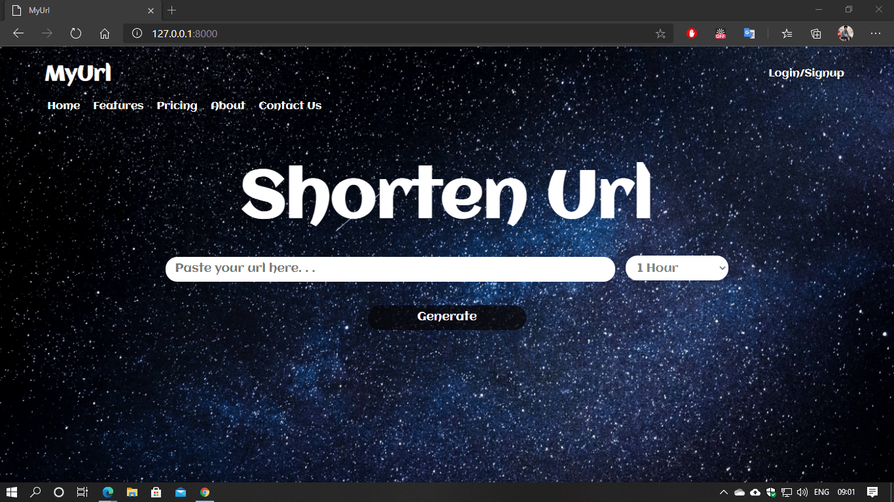
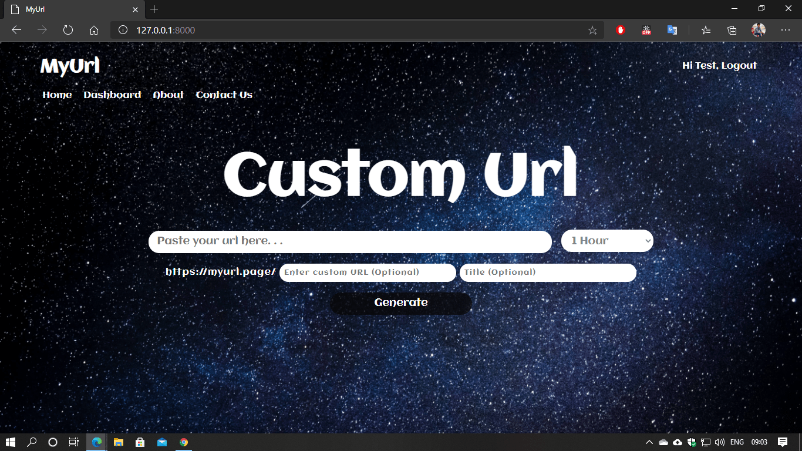
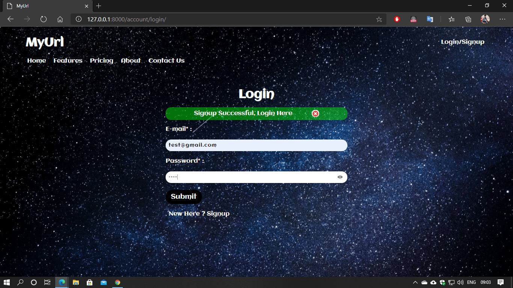
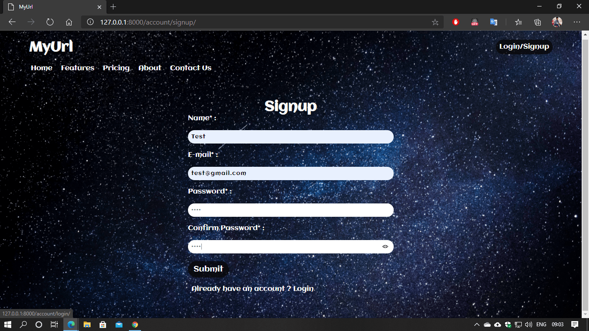
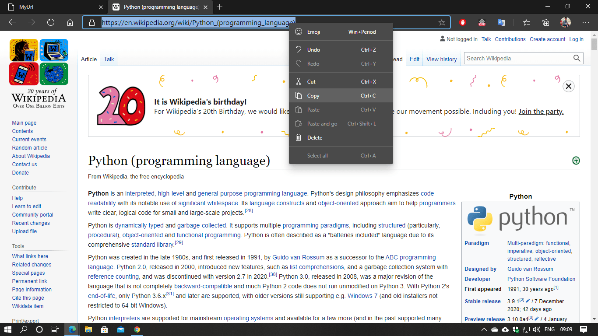
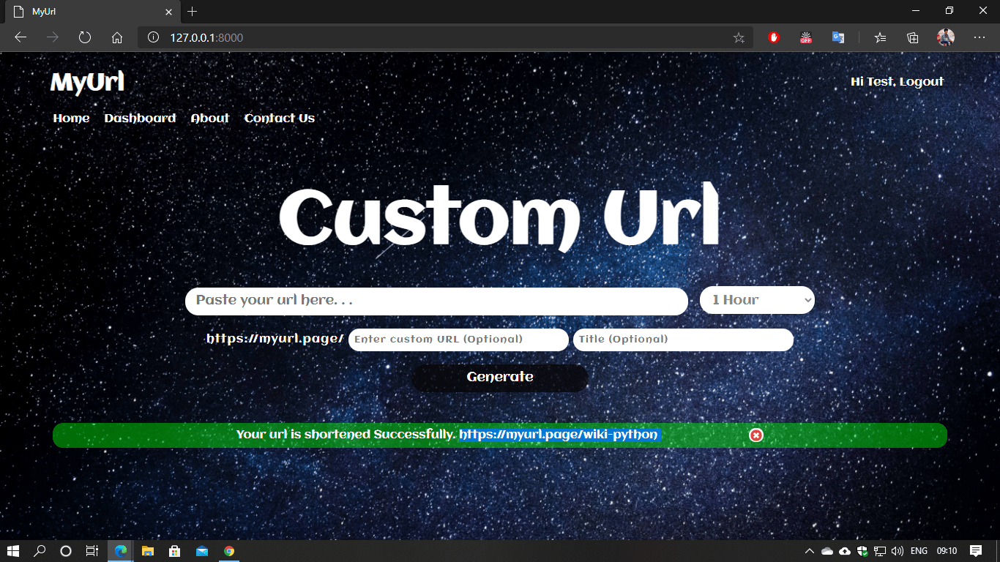
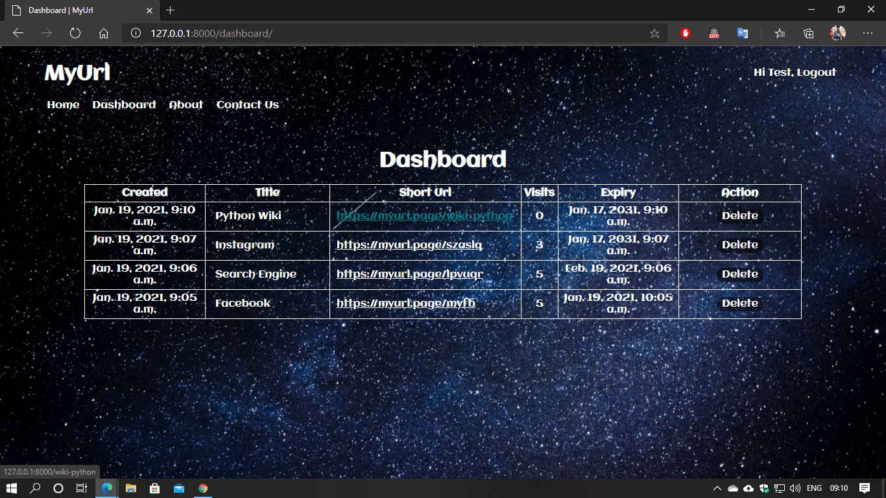

# MyUrl
MyUrl is a web application with a user-friendly interface for shortening, managing and tracking lengthy urls.

### Home Page
This is a common homepage for not authenticated users.

### User Home Page
This is a homepage for authenticated users.

### Login
1. Simply login with your email and password.

### Signup
1. Signup for account to access the dashboard.
2. Enter name, email and password to signup.

### Working

#### Copy the url you want to shorten. 

#### Paste the url in Myurl.

1. You can also set custom characters for your url.
2. Custom Char and title are optional 

#### Your URL will be shortened. 

### Dashboard
1. Login is required to access dashboard.
2. You can view Orginal Url, Short Url, Visits, Created and Expiry date.
3. you can also delete unwanted urls.

